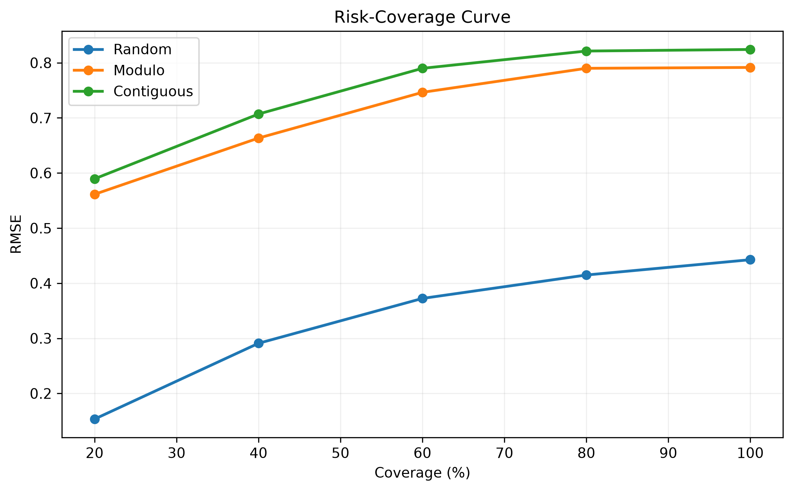
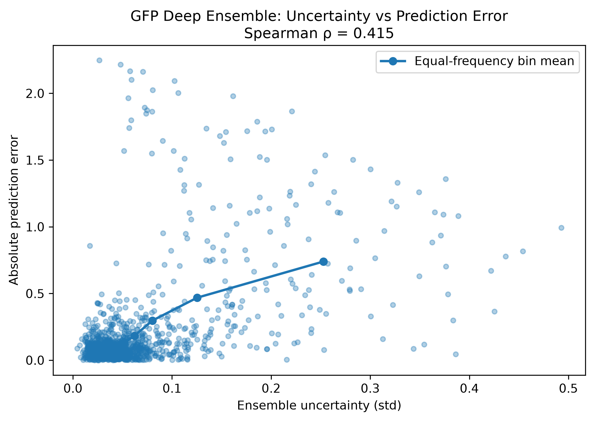
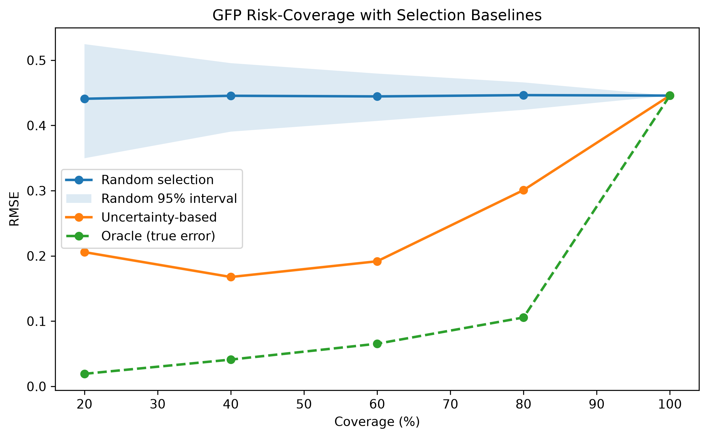
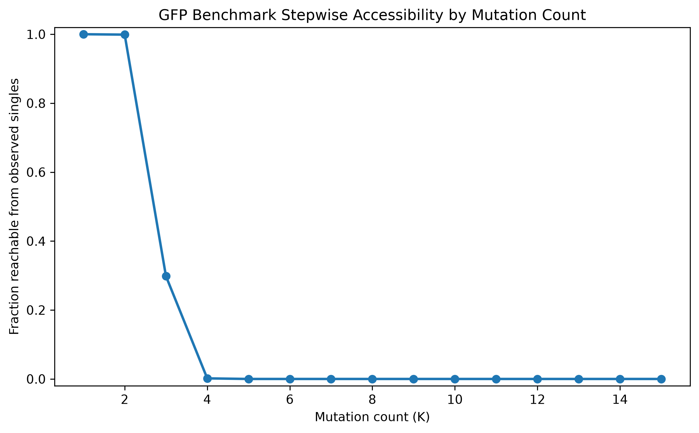
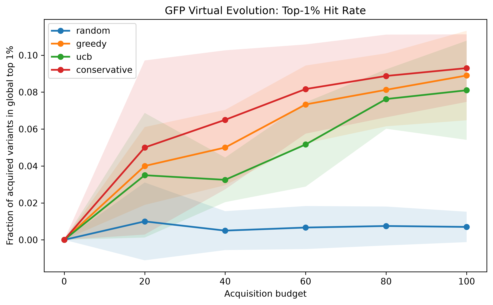

# Protein Virtual Evolution

[English README](README.md)

**단백질 언어 모델을 활용한 불확실성 인지형 단백질 적합도 예측, 가상 유도 진화 및 구조 기반 후보 검증**

이 프로젝트는 단백질 언어 모델을 사용해 단백질 돌연변이의 기능적 영향을 예측하고, 제한된 실험 예산 아래에서 **불확실성을 고려해 고적합도 변이체를 우선 탐색**하는 것을 목표로 합니다. 최종 워크플로는 **ESM-C 표현 추출**, 지도학습 기반 적합도 예측, **Deep Ensemble 불확실성 추정**, 회고적 가상 유도 진화, **ESM3 기반 신규 서열 생성**, 독립적인 **ColabFold/AlphaFold2 구조 검증**, GFP 기능 부위 보존 분석, 그리고 단백질 간 외부 검증으로 구성됩니다.

---

## 핵심 결과

| 단백질 | 주요 역할 | 핵심 결과 |
|---|---|---|
| **TEM-1** | 분포 변화 환경에서의 일반화 성능 평가 | Random OOF Spearman **0.9167**, unseen-position **0.7798**, unseen-region **0.7666** |
| **GFP** | 불확실성 인지형 가상 진화 | 전체 후보 풀의 약 **0.20%**만 평가하면서 Conservative acquisition으로 **top-1% 변이체 9.3배 enrichment** 달성 |
| **TPMT** | 외부 단백질 검증 | TPMT 전용 튜닝 없이 Random OOF Spearman **0.5755**, unseen-position **0.5111** |
| **ESM3 설계** | 신규 GFP 후보 생성 | 신규 서열 **47개** 생성, 이 중 **29개**가 seed 대비 예측 평균과 conservative score 모두 개선, 다양성 기반 최종 shortlist **6개** |
| **구조 검증** | GFP 후보의 cross-model 검토 | 최종 6개 후보 모두 AlphaFold2에서 seed-like fold 유지, chromophore-neighborhood RMSD **0.050–0.097 Å**로 WT self-variability (**0.131 Å**) 이하 |

본 프로젝트에서는 ensemble disagreement를 **상대적인 경험적 신뢰도 신호**로 사용하며, 보편적으로 calibration된 confidence interval로 해석하지 않습니다.

---

## 최종 파이프라인

```text
ProteinGym DMS
      ↓
데이터 전처리
      ↓
ESM-C 단백질 표현 추출
      ↓
적합도 예측
      ↓
일반화 성능 평가
      ↓
Deep Ensemble 불확실성 추정
      ↓
Selective prediction / 후보 우선순위화
      ↓
회고적 가상 유도 진화
      ↓
ESM3 신규 후보 생성
      ↓
ColabFold / AlphaFold2 cross-model 구조 검증
      ↓
GFP 기능 부위 보존 분석
      ↓
단백질 간 외부 검증
```

---

## 데이터셋

ProteinGym v1.3의 세 개 assay를 서로 다른 목적에 활용했습니다.

| 단백질 | Assay | 사용 변이체 수 | 주요 역할 |
|---|---|---:|---|
| **TEM-1** | `BLAT_ECOLX_Stiffler_2015` | single mutant 4,996개 | 일반화 + 불확실성 |
| **GFP** | `GFP_AEQVI_Sarkisyan_2016` | single 1,084개 + multi 50,630개 | 가상 진화 + 서열 생성 |
| **TPMT** | `TPMT_HUMAN_Matreyek_2018` | single mutant 3,648개 | 외부 검증 |

`DMS_score`의 스케일은 assay마다 다르므로, 서로 다른 단백질 사이에서 RMSE/MAE 절대값을 직접 비교해서는 안 됩니다.

---

# 1. TEM-1 적합도 예측, 일반화, 불확실성 평가

TEM-1은 단백질 적합도 예측 및 불확실성 추정 프레임워크를 구축하는 데 사용했습니다.

## 표현 방식

ESM-C 300M으로 WT와 mutant 서열을 인코딩했습니다.

최종적으로 선택된 TEM-1 표현은 다음과 같습니다.

```text
WT local embedding      [960]
Delta local embedding   [960]

        ↓ concatenate

Final input             [1920]
```

선택된 predictor 구조는 다음과 같습니다.

```text
[1920] → [512] → [128] → [1]
```

서로 다른 random initialization으로 5개의 모델을 학습해 Deep Ensemble을 구성했습니다.

```text
Input
[B,1920]

각 member
[B,1920] → [B,512] → [B,128] → [B,1]

Stacked member predictions
[B,5]

Ensemble mean
μ [B]

Ensemble standard deviation
σ [B]
```

ensemble mean은 예측 DMS score로, ensemble standard deviation은 상대적인 epistemic uncertainty score로 사용했습니다.

## 일반화 성능

| Split | Ensemble Spearman | RMSE | R² | Uncertainty-error ρ | High-error AUROC |
|---|---:|---:|---:|---:|---:|
| Random | **0.9167** | **0.4427** | **0.8522** | **0.5071** | **0.6864** |
| Modulo / unseen-position | 0.7798 | 0.7915 | 0.5275 | 0.4249 | 0.5954 |
| Contiguous / unseen-region | 0.7666 | 0.8241 | 0.4878 | 0.3836 | 0.5712 |

<p align="center">
  
</p>

**Risk-Coverage Curve.** 샘플을 ensemble uncertainty가 낮은 순서대로 정렬했을 때, 낮은 불확실성 구간만 유지할수록 실제 prediction error가 감소했습니다.

20% coverage에서 같은 크기의 random subset 대비 RMSE 감소율은 다음과 같습니다.

```text
Random       65.2%
Modulo       29.0%
Contiguous   28.4%
```

분포 변화가 강해질수록 uncertainty signal은 약해졌기 때문에, ensemble standard deviation은 **상대적인 ranking/filtering 신호**로 해석하며 calibrated confidence interval로 보지 않습니다.

상세 분석: [`docs/uncertainty_results.md`](docs/uncertainty_results.md)

---

# 2. GFP 회고적 가상 유도 진화

GFP에서는 **ESM-C 표현 + Deep Ensemble 불확실성**이 제한된 실험 예산에서 고적합도 multi-mutant를 우선적으로 선택하는 데 도움이 되는지 평가했습니다.

## 실험 설정

ProteinGym assay:

```text
GFP_AEQVI_Sarkisyan_2016
```

파이프라인:

```text
라벨이 있는 single mutant 1,084개
          ↓
ESM-C 300M 표현
          ↓
Branch Fusion fitness predictor
          ↓
5-member Deep Ensemble
          ↓
숨겨진 multi-mutant 후보 50,630개
          ↓
Random / Greedy / UCB / Conservative acquisition
```

## Multi-Mutant 표현

$K$개의 mutation을 가진 변이체에 대해:

```text
WT context
[K,960] → mean → [960]

Local perturbation
[K,960] → sum  → [960]

Global perturbation
[960]

        ↓ concatenate

Final input
[2880]
```

## Branch Fusion Predictor

최종 Branch Fusion 모델은 각 feature group을 독립적으로 projection한 뒤 결합합니다.

```text
WT context     [B,960] → [B,64]
Delta local    [B,960] → [B,64]
Delta global   [B,960] → [B,64]

                ↓ concatenate

               [B,192]
                  ↓
               [B,64]
                  ↓
               [B,1]

Output
[B] predicted GFP DMS_score
```

아키텍처 비교:

| Model | Parameters | OOF Spearman | RMSE | R² |
|---|---:|---:|---:|---:|
| **Branch Fusion** | **196,929** | **0.5585** | 0.4594 | 0.4543 |
| Gated Fusion | 326,017 | 0.5252 | **0.4501** | **0.4761** |
| Compact MLP | 372,929 | 0.5197 | 0.4628 | 0.4463 |

Branch Fusion은 **가장 적은 파라미터로 가장 높은 OOF Spearman**을 기록했고, Gated Fusion은 가장 좋은 RMSE와 R²를 기록했습니다.

## Deep Ensemble 불확실성

5-member Deep Ensemble을 사용하면서 predictive performance가 추가로 향상되었습니다.

```text
OOF Spearman          = 0.5921
RMSE                  = 0.4458
R²                    = 0.4862
Uncertainty-error ρ   = 0.4151
High-error AUROC      = 0.8429
```



낮은 uncertainty를 가진 subset은 동일 크기의 random subset보다 훨씬 정확했습니다.



| Coverage | Low-uncertainty RMSE | Random RMSE | Random 대비 감소율 |
|---:|---:|---:|---:|
| 20% | 0.2058 | 0.4409 | **53.3%** |
| 40% | 0.1677 | 0.4455 | **62.4%** |
| 60% | 0.1918 | 0.4445 | **56.9%** |
| 80% | 0.3009 | 0.4465 | **32.6%** |

---

## 왜 Pool-Based Virtual Evolution인가?

먼저 관측된 GFP 변이체들이 one-mutation-at-a-time graph를 충분히 형성하는지 확인했습니다.

```text
K=2 reachable : 99.88%
K=3 reachable : 29.82%
K=4 reachable :  0.17%
K≥5 reachable :  0%
```

전체 측정 multi-mutant 중 **32.5%만** single mutant에서 완전한 one-substitution path를 통해 도달할 수 있었습니다.

따라서 strict path-constrained evolution은 acquisition 품질보다 benchmark sparsity를 측정하게 될 가능성이 높다고 판단했습니다. 최종 실험은 측정된 multi-mutant pool을 대상으로 하는 **회고적 pool-based active learning** 형태로 구성했습니다.



---

## 회고적 Acquisition

초기 labeled set:

```text
single mutant 1,084개
```

숨겨진 candidate pool:

```text
multi-mutant 50,630개
```

Acquisition budget:

```text
100 candidates
≈ 전체 multi-mutant pool의 0.20%
```

multi-mutant label을 보기 전에 acquisition policy를 고정했습니다.

$$
\text{Greedy}(x)=\mu(x)
$$

$$
\text{UCB}(x)=\mu(x)+\sigma(x)
$$

$$
\text{Conservative}(x)=\mu(x)-\sigma(x)
$$

uncertainty-aware policy에서는 $\beta=1$을 사용했습니다.

각 round에서 선택된 candidate의 label을 hidden oracle을 통해 공개하고, labeled set에 추가한 뒤 ensemble을 다시 학습했습니다.

## Acquisition 결과

**10개 simulation seed**에 대한 최종 결과:

| Policy | Best acquired multi | Mean acquired fitness | Top-5 mean | Top-1% hits / 100 | Top-100 recovered |
|---|---:|---:|---:|---:|---:|
| Random | 3.8908 ± 0.0666 | 2.6563 | 3.8099 | 0.7 | 0.2 |
| Greedy | 4.0869 ± 0.0031 | 3.4227 | 3.9737 | 8.9 | **2.2** |
| UCB | 4.0759 ± 0.0323 | 3.3125 | 3.9654 | 8.1 | 2.1 |
| Conservative | **4.0879 ± 0.0041** | **3.4870** | **3.9800** | **9.3** | 2.1 |

global top 1%는 전체 candidate pool의 1%에 해당하지만, Conservative acquisition은 **9.3%의 top-1% hit rate**를 기록했습니다. 이는 candidate-pool prevalence 대비 약 **9.3배 enrichment**입니다.



따라서 주요 결과는 새로운 global optimum을 회수했다는 것이 아니라, **제한된 screening budget에서 고적합도 multi-mutant를 sample-efficient하게 enrichment했다는 점**입니다.

> 초기 best single mutant: `4.113576`<br>
> 전체 best multi-mutant: `4.123109`<br>
> Budget 100 내 best acquired multi-mutant: ~`4.088`

초기 single-mutant set에 이미 global maximum과 매우 가까운 변이체가 포함되어 있었기 때문에, 초기 best를 넘어서는 것은 특히 어려운 조건이었습니다.

상세 결과: [`docs/gfp_virtual_evolution_results.md`](docs/gfp_virtual_evolution_results.md)

---

# 3. ESM3 신규 후보 생성

fitness predictor와 uncertainty signal의 회고적 검증 이후, 측정된 ProteinGym pool에 존재하지 않는 **신규 GFP 서열**을 ESM3로 생성했습니다.

## 생성 전략

high-confidence seed variant는 conservative acquisition score를 기준으로 정렬했습니다.

$$
\text{Conservative}(x)=\mu(x)-\sigma(x)
$$

각 seed에 대해:

1. 상위 candidate pool의 mutation-position frequency를 활용해 design position을 선택하고,
2. 정확히 하나의 residue를 mask한 뒤,
3. ESM3로 substitution을 생성하고,
4. 변화가 없는 서열, invalid sequence, duplicate, ProteinGym에 이미 존재하는 서열을 제거했습니다.

## 생성 결과

```text
신규 생성 후보                  : 47
seed 대비 μ 개선                : 36 / 47 (76.6%)
seed 대비 μ−σ 개선              : 29 / 47 (61.7%)
다양성 기반 최종 shortlist      : 6
```

생성된 candidate는 frozen ESM-C + 5-member Deep Ensemble pipeline으로 다시 평가했습니다.

$N=47$개 후보에 대해:

```text
Generated sequences         [47,238 aa]

ESM-C residue embeddings    [47,238,960]

WT context                  [47,960]
Delta local                 [47,960]
Delta global                [47,960]

Final feature X             [47,2880]

Member predictions          [47,5]
Predicted mean μ            [47]
Uncertainty σ               [47]
```

이 후보들은 **계산적으로 우선순위화된 설계안**이며, 실험적으로 검증된 성능 향상을 의미하지 않습니다.

대표적인 high-ranked candidate:

```text
Y39N:K52M:P75S:E132G:K158G:I229V

Predicted μ            = 4.2198
Uncertainty σ          = 0.0952
Conservative score     = 4.1247
Δμ vs seed             = +0.2280
Δ(μ−σ) vs seed         = +0.2004
```

---

# 4. 구조 및 기능 부위 타당성 검증

최종 GFP shortlist 6개에 대해 ESM3 구조 sanity check, 독립적인 ColabFold/AlphaFold2 구조 예측, 그리고 GFP functional-site preservation 분석을 순차적으로 수행했습니다.

## 4.1 ESM3 구조 Sanity Check

각 candidate, 해당 seed, WT GFP를 ESM3로 반복 folding했습니다.

```text
Raw ESM3 coordinates
[238,37,3]

Cα coordinates
[238,3]
```

그러나 동일한 WT sequence를 반복 예측했을 때도 큰 stochastic variability가 나타났습니다.

```text
WT self-RMSD mean    = 6.2410 Å
WT self-RMSD median  = 6.5275 Å
WT mean pLDDT        = 0.7620
WT mean pTM          = 0.7461
```

따라서 ESM3 구조 예측 자체의 변동성이 큰 상황에서 candidate–seed RMSD를 mutation-induced structural change로 직접 해석하지 않았습니다. ESM3 구조 분석은 **qualitative sanity check**로만 사용했습니다.

## 4.2 ColabFold / AlphaFold2 Cross-Model 구조 검증

동일 모델로 생성과 평가를 모두 수행하는 편향을 줄이기 위해 WT, 6개 seed, 6개 candidate를 ColabFold/AlphaFold2로 독립적으로 예측했습니다.

각 sequence를 3개의 random seed로 반복 예측했습니다.

```text
13 sequences × 3 replicates = 39 predicted structures

각 structure
Cα coordinates [238,3]
```

모든 candidate에서 seed와 유사한 global fold가 유지되었습니다.

| Candidate | Seed–candidate RMSD median | Self-variability baseline | Excess over self | Design-site displacement | Mean pLDDT | Mean pTM |
|---|---:|---:|---:|---:|---:|---:|
| candidate_01 | 1.226 Å | 1.486 Å | -0.261 Å | 0.473 Å | 94.58 | 0.890 |
| candidate_02 | 1.653 Å | 1.778 Å | -0.125 Å | 0.626 Å | 95.04 | 0.897 |
| candidate_03 | 1.418 Å | 1.465 Å | -0.047 Å | 0.400 Å | 95.23 | 0.900 |
| candidate_04 | 1.576 Å | 1.507 Å | +0.069 Å | 0.769 Å | 94.84 | 0.893 |
| candidate_05 | 0.485 Å | 1.033 Å | -0.548 Å | 0.107 Å | 95.02 | 0.897 |
| candidate_06 | 1.500 Å | 1.559 Å | -0.058 Å | 0.591 Å | 95.04 | 0.897 |

6개 중 5개 candidate는 seed–candidate RMSD가 동일 sequence 반복 예측에서 관찰된 self-variability 범위 이내였습니다. 나머지 candidate_04도 baseline을 불과 `0.069 Å` 초과했습니다.

따라서 모든 candidate가 독립적인 AlphaFold2 기반 예측에서도 **seed-like global fold**를 유지한다는 cross-model structural plausibility를 확인했습니다.

이는 실제 단백질 안정성 또는 기능의 실험적 검증을 의미하지 않습니다.

## 4.3 GFP Functional-Site Preservation

전체 fold가 유지되는 것만으로 GFP 기능 보존을 주장할 수 없기 때문에, fluorescence와 직접 관련된 chromophore 주변 local environment를 추가로 분석했습니다.

```text
Chromophore-forming motif
Ser65 – Tyr66 – Gly67

사전에 지정한 key environment residues
94, 96, 148, 203, 205, 222
```

총 9개 predefined functional residue에 대해:

```text
WT functional-site Cα
[9,3]

Candidate functional-site Cα
[9,3]

        ↓

functional-site internal RMSD
scalar
```

를 계산했습니다.

또한 WT AlphaFold2 구조에서 chromophore-forming residues 65–67의 heavy atom으로부터 **8 Å 이내**에 위치한 residue를 구하고, 3개 WT replicate의 majority vote로 chromophore neighborhood를 정의했습니다.

```text
WT-derived chromophore neighborhood
60 residues

Cα coordinates
[60,3]
```

6개 candidate 모두 chromophore-forming motif와 사전에 지정한 key environment residue를 직접 변이시키지 않았습니다.

Chromophore-neighborhood RMSD는:

```text
WT self-variability baseline : 0.13066 Å

candidate_01   0.09651 Å
candidate_02   0.09308 Å
candidate_03   0.09400 Å
candidate_04   0.08445 Å
candidate_05   0.05027 Å
candidate_06   0.07547 Å
```

로, **6개 모두 WT self-variability baseline보다 낮았습니다.**

Functional-site AlphaFold2 confidence 역시 높게 유지되었습니다.

```text
candidate functional-site pLDDT
≈ 92.7–96.4
```

candidate의 WT-relative mutation 중 chromophore-forming motif와 가장 가까운 mutation의 거리는 약 `3.43–12.88 Å`였습니다. 가장 가까운 mutation을 가진 candidate_03도 chromophore-neighborhood geometry는 WT self baseline 이하로 유지되었습니다.

> **생성된 GFP 후보들은 독립적인 AlphaFold2 기반 구조 예측에서도 seed-like global fold를 유지했고, chromophore-forming motif 주변 local geometry 역시 WT-like 수준으로 보존되었습니다. 이는 계산적인 structural and functional-site plausibility를 지지하지만, 실제 chromophore maturation, fluorescence, quantum yield 또는 thermodynamic stability의 실험적 검증을 의미하지 않습니다.**

상세 분석: [`docs/gfp_structural_functional_validation.md`](docs/gfp_structural_functional_validation.md)

### Future Work

향후 실제 wet-lab candidate selection 단계에서는 **FoldX ΔΔG**와 같은 physics-based stability estimation을 보조 필터로 추가할 수 있습니다.

---

# 5. 단백질 간 외부 검증

최종 프레임워크를 **TEM-1, GFP, TPMT**에 적용해 서로 다른 단백질, phenotype, generalization setting에서 평가했습니다.

| 단백질 | 주요 역할 | Random Spearman | Structured / external result |
|---|---|---:|---|
| TEM-1 | 분포 변화 환경에서의 일반화 | **0.917** | unseen-position 0.780 / unseen-region 0.767 |
| GFP | 불확실성 인지형 가상 진화 | 0.592 | 20–60% low-uncertainty coverage에서 RMSE 53–62% 감소 |
| TPMT | 외부 단백질 검증 | 0.575 | TPMT-specific tuning 없이 **unseen-position 0.511** |

## 단백질별 불확실성 전이

```text
TEM-1
ρ(σ, |error|) = 0.507 random
               = 0.425 unseen-position
               = 0.384 unseen-region

GFP
ρ(σ, |error|) = 0.415
High-error AUROC = 0.843

TPMT
ρ(σ, |error|) = 0.082 random
               = 0.100 unseen-position
```

TPMT에서는 sample-level error discrimination이 상대적으로 약했지만, low-uncertainty selection은 여전히 random subset 대비 RMSE를 줄였습니다.

20% coverage 기준:

```text
TPMT random
0.2356 vs 0.2647
→ 11.0% 감소

TPMT position-unseen
0.2626 vs 0.2883
→ 8.9% 감소
```

따라서 보수적으로 다음과 같이 해석합니다.

> **ESM-C representation과 lightweight fitness predictor는 서로 다른 단백질과 phenotype으로 전이되었으며, ensemble disagreement는 assay에 따라 강도가 달라지는 경험적 reliability signal로 작동했습니다.**

상세 분석: [`docs/cross_protein_validation_final.md`](docs/cross_protein_validation_final.md)

---

# 6. 재현 가능한 결과 집계

cross-protein canonical result의 수치는 **수동으로 입력하지 않습니다.**

저장된 OOF prediction으로부터 다시 계산합니다.

```bash
python scripts/build_cross_protein_summary.py --print-sources-only
python scripts/build_cross_protein_summary.py
```

Canonical outputs:

```text
results/cross_protein/
├── cross_protein_prediction_summary.csv
├── cross_protein_risk_coverage_summary.csv
├── source_manifest.csv
└── summary.json
```

`source_manifest.csv`에는 각 protein/split에 사용된 실제 OOF prediction file이 기록됩니다.

이를 통해 metric의 수동 전사 오류를 방지하고, summary 결과를 실제 저장된 실험 결과까지 추적할 수 있습니다.

---

# 7. 프로젝트 구조

```text
protein-virtual-evolution/
├── LICENSE
├── README.md
├── README_ko.md
├── data/
│   ├── raw/                         # ProteinGym assay, CV fold, reference 원본
│   └── processed/                   # 전처리 variant 및 ESM-C feature
├── docs/
│   ├── cross_protein_validation_final.md
│   ├── gfp_structural_functional_validation.md
│   ├── gfp_virtual_evolution_results.md
│   └── uncertainty_results.md
├── results/
│   ├── cross_protein/               # 재현 가능한 단백질 간 비교 요약
│   ├── gfp/
│   │   ├── architecture_ablation/
│   │   ├── deep_ensemble_uncertainty/
│   │   ├── final_ensemble/
│   │   ├── mutation_graph_audit/
│   │   ├── virtual_evolution/
│   │   ├── esm3_generation/
│   │   ├── esm3_scoring/
│   │   ├── esm3_shortlist/
│   │   ├── structural_plausibility/
│   │   ├── structural_plausibility_replicated/
│   │   ├── colabfold_structural_validation/
│   │   └── functional_site_preservation/
│   ├── tem1/                        # baseline, ablation, 일반화, 불확실성 결과
│   └── tpmt/                        # Branch Fusion CV 및 ensemble 불확실성 결과
└── scripts/                         # 전처리, 모델링, 설계, 검증, 결과 집계
```

---

# 8. 실행 환경

```text
OS      : Ubuntu 24.04 LTS
GPU     : NVIDIA Tesla T4
VRAM    : 16 GB
PyTorch : 2.11.0+cu130
CUDA    : 13.0 runtime
ESM-C   : 300M
```

Attention:

```text
PyTorch scaled_dot_product_attention
```

추가 acceleration package는 필수로 사용하지 않았습니다.

```text
Transformer Engine : disabled
flash-attn          : disabled
xformers            : disabled
```

---

# 최종 결론

이 프로젝트는 **모델 개발**, **일반화 검증**, **불확실성 평가**, **후보 우선순위화**, **신규 서열 생성**, **cross-model 구조 검증**, **기능 부위 보존 분석**, **외부 단백질 재현**을 서로 분리해 검증했습니다.

현재 결과가 직접적으로 뒷받침하는 가장 강한 결론은 다음과 같습니다.

> **단백질 언어 모델 표현과 lightweight supervised predictor의 조합은 서로 다른 단백질과 phenotype에서 유용한 변이체 ranking signal을 학습할 수 있었으며, Deep Ensemble uncertainty는 assay별로 강도는 달랐지만 추가적인 경험적 reliability signal을 제공했습니다.**

본 프로젝트는 다음을 주장하지 않습니다.

- 모든 assay에서 calibration된 보편적 uncertainty estimator를 구축했다는 주장
- ESM3로 생성한 GFP candidate가 실험적으로 기존 변이체보다 우수하다는 주장
- 새로운 GFP global optimum을 회수했다는 주장

대신, mutation-effect prediction에서 시작해 uncertainty-aware candidate prioritization, 신규 서열 생성, cross-model 구조 검증, 기능 부위 타당성 분석, 외부 단백질 검증까지 확장되는 **재현 가능한 end-to-end workflow**를 제시합니다.
