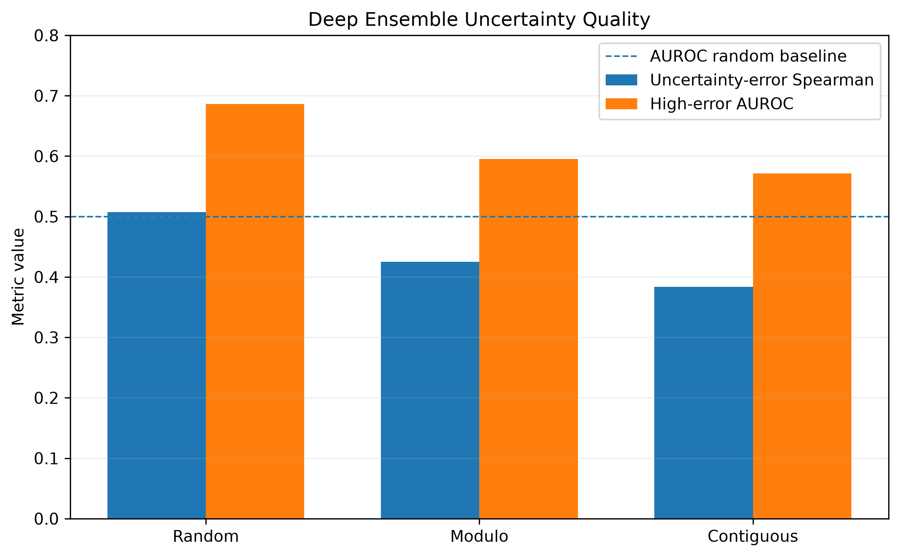
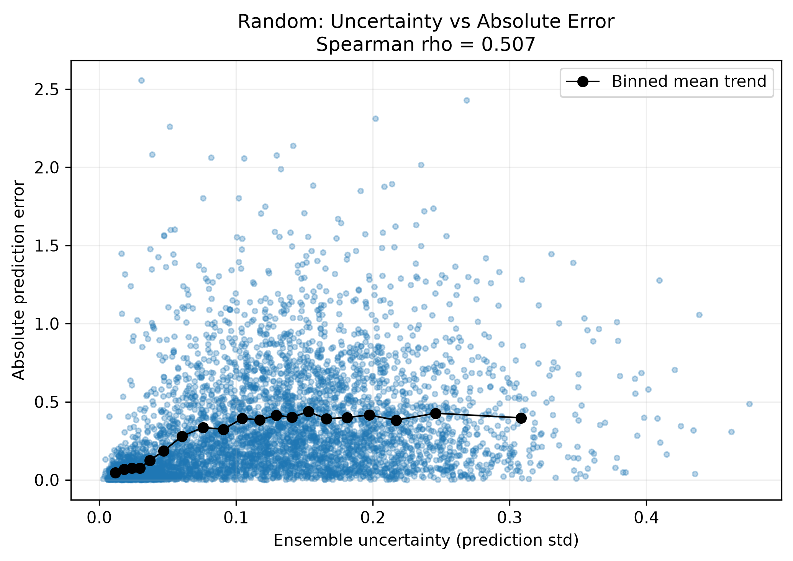
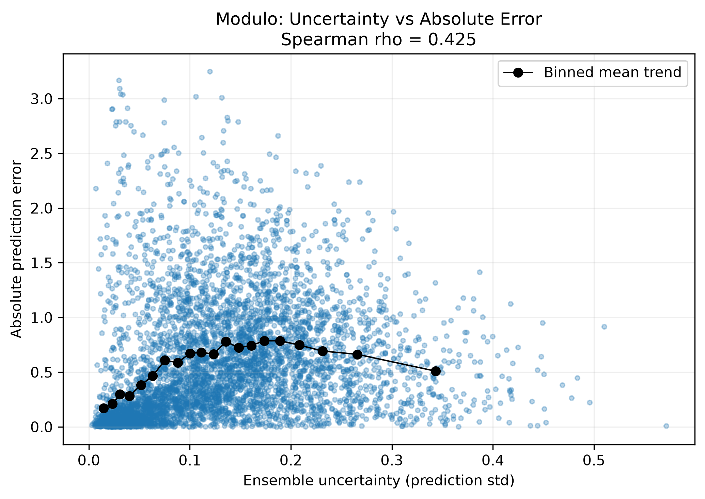
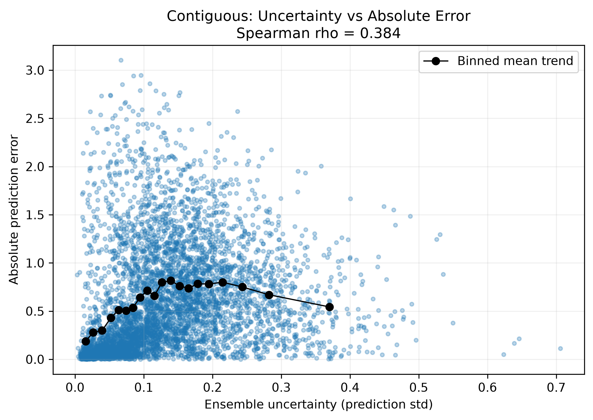
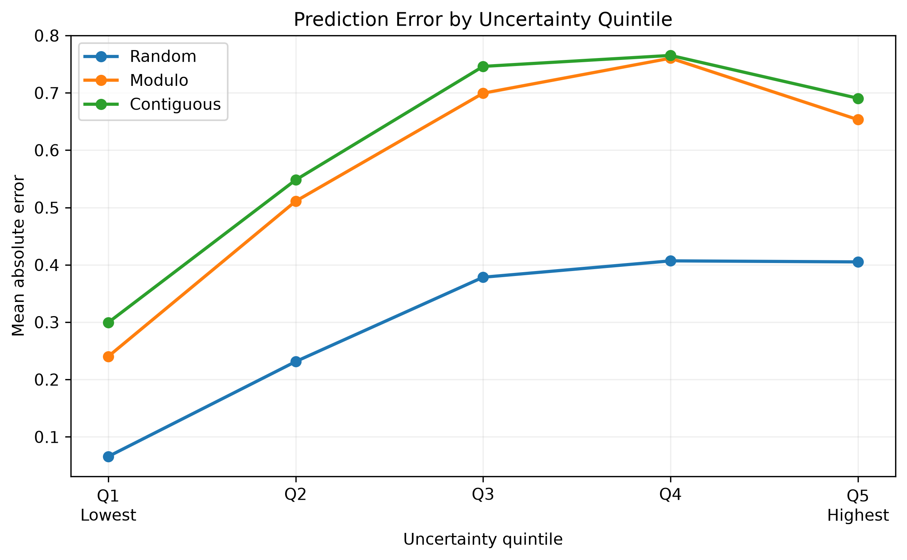
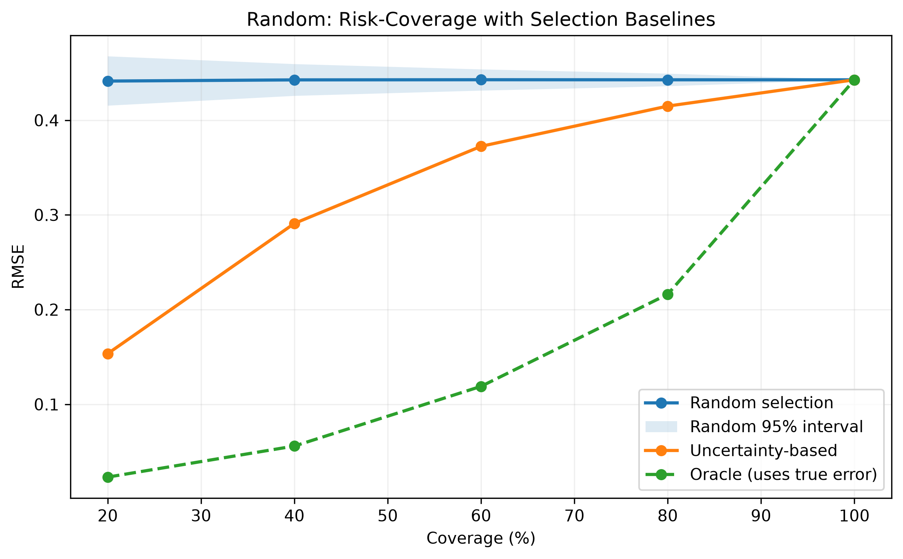
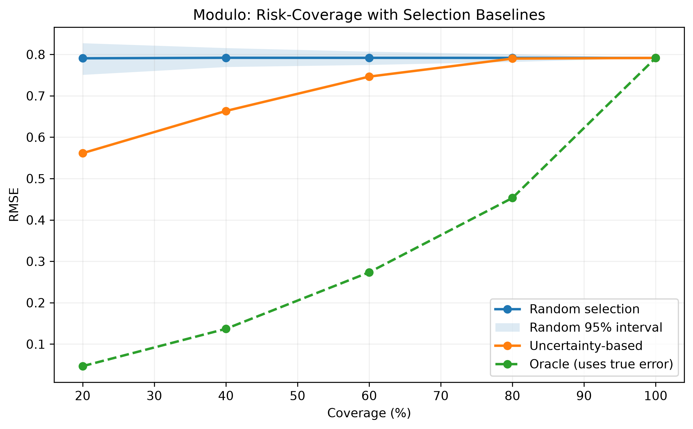
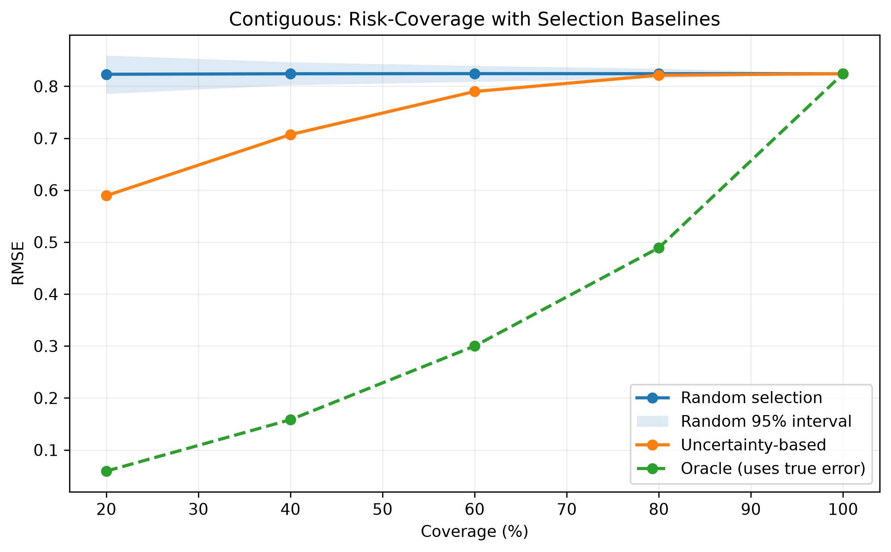

# Step 7. Deep Ensemble Uncertainty Estimation

## 1. Objective

This stage evaluates whether uncertainty estimated by a **Deep Ensemble** can provide useful information about prediction reliability and support downstream candidate selection.

The key question is not simply:

> Does uncertainty correlate with prediction error?

A more practical question is:

> **Without observing the experimental DMS score, can ensemble uncertainty identify predictions that are more reliable than equally sized random subsets?**

To answer this, we evaluate:

1. fitness prediction performance of the ensemble mean,
2. association between ensemble uncertainty and actual prediction error,
3. selective prediction using uncertainty,
4. uncertainty-based selection against **Random** and **Oracle** baselines.

---

## 2. Model Input and Output

The selected TEM-1 representation from the previous experiments is used without modification.

```text
Raw input
WT sequence      286 aa
Mutant sequence  286 aa

        ↓ ESM-C 300M

WT local         [B, 960]
Delta local      [B, 960]

        ↓ concatenate

Model input      [B, 1920]
```

Each ensemble member uses the same MLP architecture:

```text
Input              [B, 1920]
Linear 1920→512    [B, 512]
ReLU
Dropout p=0.2      [B, 512]

Linear 512→128     [B, 128]
ReLU
Dropout p=0.2      [B, 128]

Linear 128→1       [B, 1]
```

- Trainable parameters per member: **1,049,345**
- Number of ensemble members: **5**
- Ensemble seeds: **42, 43, 44, 45, 46**

For a batch of size `B`, the five independently trained models produce:

```text
Member predictions     [B, 5]

        ├─ mean(dim=1)
        │      ↓
        │   [B]
        │   predicted DMS_score
        │
        └─ std(dim=1)
               ↓
            [B]
            epistemic uncertainty
```

The **ensemble mean** is used as the final fitness prediction.

The **ensemble standard deviation** measures disagreement among the five independently trained predictors and is used as a **relative epistemic uncertainty score**.

> `ensemble_std` is not interpreted as a calibrated confidence interval, probability of correctness, or experimental measurement noise.

---

## 3. Deep Ensemble Prediction Performance

The ensemble was evaluated under the same three ProteinGym split settings used in the generalization benchmark.

| Split | Meaning | Spearman | RMSE | MAE | R² |
|---|---|---:|---:|---:|---:|
| Random | interpolation-like split | **0.9167** | **0.4427** | 0.2975 | **0.8522** |
| Modulo | unseen residue positions | 0.7798 | 0.7915 | 0.5728 | 0.5275 |
| Contiguous | unseen contiguous regions | 0.7666 | 0.8241 | 0.6099 | 0.4878 |

Averaging independently trained MLPs reduced prediction variance and improved RMSE relative to the single-MLP predictor in all three split settings.

---

# 4. Does Ensemble Uncertainty Reflect Prediction Error?

## 4.1 Uncertainty Quality Summary



**Figure 1. Uncertainty quality across generalization settings.**  
`Uncertainty-error Spearman` measures whether larger model disagreement is associated with larger absolute prediction error. `High-error AUROC` measures how well uncertainty identifies samples belonging to the top 20% of prediction errors.

| Split | Mean uncertainty | Uncertainty-error Spearman | High-error AUROC |
|---|---:|---:|---:|
| Random | 0.1177 | **0.5071** | **0.6864** |
| Modulo | 0.1289 | **0.4249** | 0.5954 |
| Contiguous | 0.1369 | **0.3836** | 0.5712 |

The uncertainty-error association is positive in all three settings.

```text
Random       ρ = 0.507
Modulo       ρ = 0.425
Contiguous   ρ = 0.384
```

However, uncertainty quality decreases as the evaluation distribution shifts further from the training data.

This indicates that ensemble disagreement contains useful reliability information, but it does not perfectly identify every prediction failure.

---

## 4.2 Uncertainty vs. Absolute Prediction Error

### Random



**Figure 2. Ensemble uncertainty vs. absolute prediction error under Random 5-fold CV.**  
Each point represents one OOF mutation prediction. The black line shows the mean absolute error within equal-frequency uncertainty bins. A positive Spearman correlation of **ρ = 0.507** indicates that predictions with stronger model disagreement tend to have larger errors.

### Modulo



**Figure 3. Ensemble uncertainty vs. absolute prediction error for unseen residue positions.**  
The association remains positive under position-level distribution shift (**ρ = 0.425**), but is weaker than under Random splitting.

### Contiguous



**Figure 4. Ensemble uncertainty vs. absolute prediction error for unseen contiguous protein regions.**  
The association remains positive under the strongest extrapolation setting (**ρ = 0.384**), although model disagreement is less effective at identifying errors than in the Random setting.

A key limitation is visible in both Modulo and Contiguous results: several predictions have relatively low ensemble disagreement but large errors. This can occur when all ensemble members share the same representation, architecture, and training data and therefore make similar mistakes.

---

## 4.3 Prediction Error by Uncertainty Quintile



**Figure 5. Mean absolute prediction error across uncertainty quintiles.**  
OOF predictions were divided into five equally sized groups from Q1 (lowest uncertainty) to Q5 (highest uncertainty).

| Split | Q1 MAE | Q2 MAE | Q3 MAE | Q4 MAE | Q5 MAE |
|---|---:|---:|---:|---:|---:|
| Random | 0.0657 | 0.2313 | 0.3784 | 0.4070 | 0.4052 |
| Modulo | 0.2402 | 0.5111 | 0.6994 | 0.7605 | 0.6533 |
| Contiguous | 0.2994 | 0.5481 | 0.7462 | 0.7653 | 0.6905 |

The lowest-uncertainty group consistently has much smaller error than the remaining groups.

The relationship is not perfectly monotonic: Q5 has slightly lower error than Q4 in every split. Therefore, uncertainty should not be described as a perfect ranking of expected prediction error.

A more precise conclusion is:

> **Ensemble uncertainty clearly identifies a low-risk subset, but does not perfectly order all high-uncertainty predictions by their eventual error.**

---

# 5. Main Analysis: Risk-Coverage with Selection Baselines

The previous analysis showed that low-uncertainty predictions have lower observed error. However, this alone does not establish that uncertainty provides useful selection information.

We therefore compare three strategies at identical coverage.

### Uncertainty-based selection

Samples are ranked using only:

```text
ensemble_std
```

from lowest uncertainty to highest uncertainty.

The experimental DMS score is not used.

### Random selection

The same number of samples is selected uniformly at random.

For each coverage level, random selection is repeated **1,000 times**.

The plots report:

- mean Random RMSE,
- empirical 95% interval across the 1,000 selections.

### Oracle selection

Samples are retrospectively ranked by their **true absolute prediction error**:

```text
|ensemble_mean - DMS_score|
```

This uses the experimental label and therefore **cannot be used in practice**.

It is included only as an idealized retrospective lower-bound reference.

---

## 5.1 Random Split



**Figure 6. Risk-coverage comparison under Random splitting.**  
At low and moderate coverage, uncertainty-based selection strongly outperforms equally sized random subsets. At 20% coverage, uncertainty-based selection achieves RMSE **0.154**, compared with a random-selection mean of **0.441**, corresponding to a **65.2% reduction in RMSE**. None of the 1,000 random subsets achieved an RMSE as low as the uncertainty-selected subset at 20%, 40%, 60%, or 80% coverage.

| Coverage | Uncertainty RMSE | Random RMSE | Random 95% interval | Oracle RMSE | RMSE reduction vs Random |
|---:|---:|---:|---:|---:|---:|
| 20% | **0.154** | 0.441 | 0.415–0.467 | 0.023 | **65.2%** |
| 40% | **0.291** | 0.443 | 0.426–0.459 | 0.056 | **34.2%** |
| 60% | **0.372** | 0.443 | 0.431–0.454 | 0.119 | **15.9%** |
| 80% | **0.415** | 0.443 | 0.436–0.449 | 0.216 | **6.3%** |
| 100% | 0.443 | 0.443 | 0.443–0.443 | 0.443 | 0% |

The large gap between Random and Uncertainty-based selection demonstrates that ensemble disagreement contains actionable information about prediction reliability.

---

## 5.2 Modulo Split



**Figure 7. Risk-coverage comparison for unseen residue positions.**  
Uncertainty-based selection remains useful under position-level distribution shift. At 20% coverage, RMSE decreases from a random-selection mean of **0.791** to **0.561**, a **29.0% reduction**. The benefit remains visible through 60% coverage, but becomes negligible at 80% coverage.

| Coverage | Uncertainty RMSE | Random RMSE | Random 95% interval | Oracle RMSE | RMSE reduction vs Random |
|---:|---:|---:|---:|---:|---:|
| 20% | **0.561** | 0.791 | 0.751–0.827 | 0.047 | **29.0%** |
| 40% | **0.663** | 0.792 | 0.769–0.815 | 0.137 | **16.2%** |
| 60% | **0.746** | 0.792 | 0.774–0.807 | 0.273 | **5.7%** |
| 80% | 0.790 | 0.792 | 0.782–0.800 | 0.453 | 0.2% |
| 100% | 0.792 | 0.792 | 0.792–0.792 | 0.792 | 0% |

For 20%, 40%, and 60% coverage, none of the 1,000 random subsets achieved an RMSE as low as the uncertainty-ranked subset.

At 80% coverage, the uncertainty strategy falls within the random-selection distribution, indicating that most of its useful filtering power is concentrated in the lower-coverage region.

---

## 5.3 Contiguous Split



**Figure 8. Risk-coverage comparison for unseen contiguous protein regions.**  
Even under regional extrapolation, uncertainty-based selection identifies a lower-risk subset. At 20% coverage, RMSE decreases from **0.823** for random selection to **0.589**, corresponding to a **28.4% reduction**.

| Coverage | Uncertainty RMSE | Random RMSE | Random 95% interval | Oracle RMSE | RMSE reduction vs Random |
|---:|---:|---:|---:|---:|---:|
| 20% | **0.589** | 0.823 | 0.785–0.859 | 0.059 | **28.4%** |
| 40% | **0.707** | 0.824 | 0.802–0.846 | 0.158 | **14.2%** |
| 60% | **0.790** | 0.824 | 0.808–0.839 | 0.300 | **4.2%** |
| 80% | 0.821 | 0.824 | 0.815–0.834 | 0.489 | 0.4% |
| 100% | 0.824 | 0.824 | 0.824–0.824 | 0.824 | 0% |

As in the Modulo split, uncertainty provides the greatest benefit when only a relatively small, high-confidence subset is selected.

At 80% coverage, the uncertainty-selected subset is no longer meaningfully different from random selection.

---

# 6. Interpretation of the Risk-Coverage Results

The central result is not simply:

> “Low uncertainty samples have lower error.”

The stronger result is:

> **Without access to experimental DMS scores, Deep Ensemble uncertainty identifies subsets with substantially lower prediction error than equally sized random subsets.**

This distinction is important because candidate selection must occur before the true experimental fitness is known.

At 20% coverage:

| Split | Random RMSE | Uncertainty RMSE | Reduction |
|---|---:|---:|---:|
| Random | 0.441 | **0.154** | **65.2%** |
| Modulo | 0.791 | **0.561** | **29.0%** |
| Contiguous | 0.823 | **0.589** | **28.4%** |

The uncertainty signal therefore has **decision utility**, not merely statistical association with error.

However, the utility decreases as coverage increases.

```text
Low coverage
→ strong filtering
→ uncertainty can discard many unreliable predictions
→ large improvement over Random

High coverage
→ most samples must eventually be included
→ less freedom to filter
→ Uncertainty and Random converge

100% coverage
→ all samples are used
→ Random = Uncertainty = Oracle by construction
```

The Oracle curve also shows substantial remaining headroom.

Deep Ensemble uncertainty captures part of the information required to identify reliable predictions, but does not recover the ideal error ranking.

---

# 7. What Does the Uncertainty Represent?

For a single mutation:

```text
x = [WT local, Delta local]
x shape = [1920]
```

five independently trained MLPs produce:

```text
ŷ1, ŷ2, ŷ3, ŷ4, ŷ5
```

The final prediction is:

\[
\mu(x)=\frac{1}{5}\sum_{m=1}^{5}\hat{y}_m(x)
\]

and the uncertainty score is the standard deviation across the five predictions:

\[
\sigma(x)
=
\sqrt{
\frac{1}{M-1}
\sum_{m=1}^{M}
\left(\hat{y}_m(x)-\mu(x)\right)^2
}
\]

where \(M=5\).

A small \(\sigma(x)\) means that independently initialized predictors converge to similar predictions.

A large \(\sigma(x)\) means that the prediction is sensitive to model initialization and optimization, suggesting that the current data and model do not constrain the prediction as strongly.

This is interpreted as a proxy for **epistemic uncertainty**.

It does **not** measure:

- wet-lab measurement noise,
- biological stochasticity,
- probability that the prediction is correct,
- a calibrated DMS-score confidence interval.

---

# 8. Limitations

## 8.1 Ensemble members share the same modeling assumptions

All five members use:

- the same ESM-C representation,
- the same MLP architecture,
- the same training samples,
- the same preprocessing.

Therefore, all members can agree and still be wrong.

This explains why low uncertainty does not guarantee low error and why uncertainty quality decreases under stronger distribution shift.

---

## 8.2 Uncertainty-error ranking is not perfectly monotonic

The uncertainty quintile analysis shows that Q5 does not consistently have larger error than Q4.

Therefore, the uncertainty score is more effective at separating:

```text
very reliable predictions
vs.
the rest
```

than at perfectly ranking every sample from most reliable to least reliable.

---

## 8.3 Raw ensemble standard deviation is not calibrated

The current analysis validates **relative uncertainty ranking**.

It does not establish:

```text
prediction ± ensemble_std
```

as a valid confidence interval.

Formal predictive interval calibration would require an additional calibration method and evaluation protocol.

---

## 8.4 Oracle is not a usable method

Oracle ranking uses the true DMS score and is included only for retrospective comparison.

It represents an unattainable lower-bound reference and must not be described as a practical candidate-selection method.

---

# 9. Step 7 Conclusion

The 5-member Deep Ensemble provides:

```text
ensemble_mean
→ predicted DMS_score

ensemble_std
→ relative epistemic uncertainty
```

The uncertainty signal satisfies several useful properties:

1. It is positively associated with actual prediction error.
2. Low-uncertainty samples form a substantially more reliable subset.
3. Uncertainty-based selection outperforms equally sized random subsets at low-to-moderate coverage.
4. The benefit persists under unseen-position and unseen-region distribution shifts.
5. The signal becomes weaker as distribution shift and coverage increase.

The strongest quantitative evidence is observed at 20% coverage:

```text
Random split
Random selection       RMSE = 0.441
Uncertainty selection  RMSE = 0.154
Reduction                   = 65.2%

Modulo split
Random selection       RMSE = 0.791
Uncertainty selection  RMSE = 0.561
Reduction                   = 29.0%

Contiguous split
Random selection       RMSE = 0.823
Uncertainty selection  RMSE = 0.589
Reduction                   = 28.4%
```

Therefore, Deep Ensemble uncertainty will be used in the next stage as a **relative candidate-ranking and filtering signal**, rather than as a calibrated probability.

---

# 10. Connection to Virtual Directed Evolution

The next stage evaluates whether uncertainty can improve candidate discovery under a limited experimental budget.

The Deep Ensemble provides each candidate with:

```text
predicted fitness = μ
uncertainty       = σ
```

This enables multiple selection policies:

```text
Random
→ no model information

Greedy
→ score = μ

UCB / Exploration
→ score = μ + βσ

Conservative
→ score = μ - βσ
```

The retrospective virtual directed evolution experiment will evaluate whether these strategies discover high-fitness variants more efficiently than random selection when only a limited number of experimental labels can be revealed.
